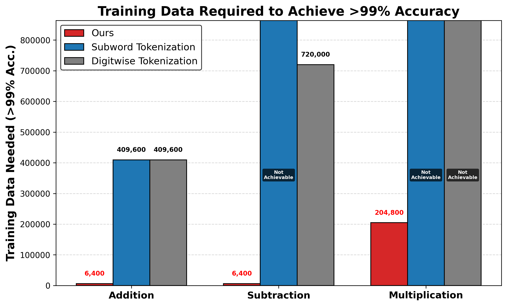
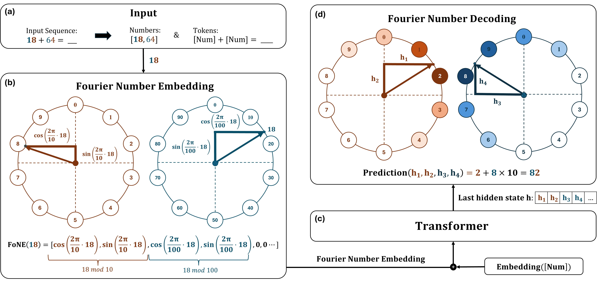

# Fourier Number Embedding (FoNE)

[](https://arxiv.org/abs/2502.09741)
[](https://github.com/KevinZhoutianyi/FNE)
[](https://fouriernumber.github.io/)

📌 **FoNE: Precise Single-Token Number Embeddings via Fourier Features**

🔢 Efficient and accurate numerical representation for **Large Language Models (LLMs)**.

---

## 🔥 Why Fourier Number Embedding (FoNE)?

### 🚀 **Solving Tokenization Limitations in LLMs**

Traditional LLMs tokenize numbers inefficiently, leading to:

- Multiple tokens per number (e.g., `"12345.6789"` → **5 tokens in GPT-4, 10 in LLaMA2**).
- Loss of precision, impacting **arithmetic and numerical reasoning**.

FoNE directly maps numbers to their **Fourier representations**, making:

* ✅ **Running time more efficient**
* ✅ **Number embeddings precise**
* ✅ **Data efficiency improved**

🔗 **[Read the full details on our website](https://kevinzhoutianyi.github.io/FNE_website/)**

---

## 📈 Key Benefits of FoNE

- ✅ **Single-token number embeddings**
- ✅ **Improves accuracy on arithmetic tasks**
- ✅ **Reduces training data needs by up to 64×**
- ✅ **Works for any numeric data, including decimals & large numbers**

### 🎯 **Example: Tokenization Comparison**

| Tokenizer                                 | Tokenized Representation | Tokens Used    |
| ----------------------------------------- | ------------------------ | -------------- |
| **GPT-4, LLaMA3.2 (BPE)**           | `123 45 . 678 9`       | **5**    |
| **LLaMA2 (Digitwise Tokenization)** | `1 2 3 4 5 . 6 7 8 9`  | **10**   |
| **FoNE (Ours)**                     | `12345.6789`           | **1** ✅ |

---

## 📊 Empirical Results

### **📌 Accuracy Trends on Arithmetic Tasks**

FoNE achieves **99%+ accuracy with 64× less data** compared to baseline models.

📌 **Performance Highlights:**
✅ **100% accuracy on 6-digit integer addition**
✅ **98.4% accuracy on 50-digit integer addition**
✅ **Significant gains in subtraction & multiplication tasks**



---

## 🔧 How Does FoNE Work?



## 📖 Citation

If you find this project useful, please cite our work:

```bibtex
@article{zhou2025fone,
  title={FoNE: Precise Single-Token Number Embeddings via Fourier Features},
  author={Zhou, Tianyi and Fu, Deqing and Soltanolkotabi, Mahdi and Jia, Robin and Sharan, Vatsal},
  journal={arXiv preprint arXiv:2502.09741},
  year={2025}
}
```

---

## ✉️ Contact

If you would like to discuss applying **Fourier Number Embedding (FoNE)** to quantization, data analysis, time series, or others—or explore adding new features to FNE, feel free to connect!
📧 **Email:** [tzhou029@usc.edu](mailto:tzhou029@usc.edu)

🚀 **If you find this useful, don't forget to ⭐️ the repo!** 🚀
-------------------------------------------------------------
